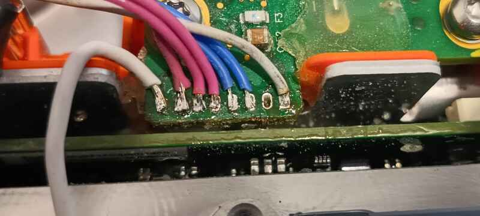

# Tesla GEN3 Single Phase Module Controller

- **[Fig. 1]:** *Top view of single phase module within Tesla charger (BCB)*

This page is available in [DOXYGEN](https://furdog.github.io/tesla_gen3_bcb/) format
### WIP
The project is actively work in progress and not ready for any usage yet.

### Useful Resources 💡
* [Project that was used as inspiration](https://github.com/damienmaguire/Tesla-Charger) - Damien's software for controlling Tesla charger
* [Openinverter page of the charger](https://openinverter.org/wiki/Tesla_Model_S/X_GEN3_Charger) - Gives broad description of the module
    >(⚠️Description of the internal module pins on the page is partially incorrect)
* [Alternative Tesla charger software](https://github.com/jsphuebner/stm32-teslacharger) - Another piece of work, similar to Damien's software

## Project overview
The `tg3spmc` library provides a **hardware-agnostic** logic layer for controlling a **Tesla GEN3 Single Phase Module**, which is an internal component of the Tesla GEN3 Battery Controller Board (BCB).

This library implements the module's state machine, handles the encoding and decoding of **CAN 2.0 frames**, and manages the module's control signals (power on, charge enable).

**Key Features:**
  * **Pure C:** Specifically ANSI(C89) standard, featuring linux kernel style formatting
  * **MISRA-C compliant:** Integration providen by cppcheck (100% compliance achieved for core library)
  * **Designed by rule of 10:** No recursion, dynamic memory allocations, callbacks, etc
  * **Deterministic:** Designed with constant time execution in mind
  * **Hardware agnostic:** Absolute ZERO hardware-dependend code (except the examples)
  * **Zero dependency:** No dependencies has been used except standart library
  * **Object oriented:** Though written on C, the project tries to use handles and method-like functions.
  * **Asynchronous:** Fully asynchronous API, zero delay
  * **Automated tests:** Automatically tests main features (not TDD though, but aimed to be in the future)
  * **Single header:** Makes integration with other projects super simple and seamless
  * **Documentated:** It is not really well made yet, but it's on the priority!
  * **GitHub actions:** Automated checks and doxygen generation

**Pitfalls:**
  * **Reverse engineering:** This is not an official firmware :(
  * **WIP:** Actively work in progress (not for production) 
  * **Not certified:** Use it at own risk

## Why?
Damien's project aims specific hardware and specific setup. There are implementation of SAE J1772,
external CAN communication and other non-charger related stuff & features.
All of that is written with little consideration in style, testablity and modularity.

Damien's provides very fragmented knowledge or information.
I have personally found his tutorials and videos unnecessarily long and really hard to follow.

So i decided to write my own, "pure" implementation of tesla charger, aiming to control single module.
There will be no additional features. There's exactly only core controlling logic packed into very 
minimalist and straightforward API.

## Specific module used in the project
| Description | Code |
| :--- | :--- |
| **PCB Design code** | FAB 1034376-00-D REV-01 |
| **Specific part code (QR)** | p1045483-00-d:REV03:S0317AS0001706 |


- **[Fig. 2]:** *Module used in this project*

## About module
There are generally 3 or 2 similar modules within single BCB.
We've just extracted other module(s). I strongly advice not to do that if you plan to use
board outside of BCB. Because it's simply not designed to be outside... You'll have a big
trouble with cleaning thermal resin mess and designing a hull or a cooling system for it.
just don't do it that way. You have been warned.

---

### Components
The module contains a lot of various components that will be listed here upon research.
Currently only most significant components are present. There are really more
stuff to discover that may to drop some shades onto the architecture 
of the module, but unfortunately i am not the expert in the field of electronics,
so any external help is highly appreciated.

### Logic and Control
| Component | Part Number/ID | Location/Notes *(see **Fig. 1**)*|
| :--- | :--- | :--- |
| **MCU** | TMS320 F28035PAG0 | The big one in center of the module |
| **CPLD** | ALTERA 5M160ZE64A5N | Smaller piece, right from the MCU |

It's likely that MCU used for general complex tasks and communication while
CPLD is used for time-critical peripheral control.

I'd like to document and discover signals for every pin,
but thats gonna take some time and wish (which i do not have at the moment).

### Power Components

- **[Fig. 3]:** *There are two fuses at the AC input side (see **Fig. 1** rightmost side of the module)*

### Peripherals and Pinout
Our custom control hardware will use the 8 pin interface *(see **Fig. 4**)* to talk with the module.

The 8 pin interface is located at the leftmost side of the board *(see **Fig. 1**)*.

>matches *(**Fig. 4**)* [1 2 3 4 5 6 7 8]

| Pin | Value | Description |
| :---: | :--- | :--- |
| **1** | 12V-in | Supply pin leftmost on each module |
| **2** | GND | Ground |
| **3** | PWR-in | 3.3v signal (HIGH will power the charger) |
| **4** | CHG-in | 3.3v signal (HIGH will enable charge mode) |
| **5** | CANL | CAN2.0 bus |
| **6** | CANH | CAN2.0 bus |
| **7** | ? | Unknown |
| **8** | 5V-in | Looks like it's a reference voltage for CAN transciever (needs research) |

>Do not forget to add a **120Ω terminating resistor** between the **CANH/CANL** pins.

**⚠️ IMPORTANT NOTE:** you must disconnect original control board from the module.
Either desolder it, or cut, as we do not need it, since custom control board will be used.
The original control board connected to each single phase module via 8 pin interface.

- **[Fig. 4]:** *8 pin interface*


---

### Communication details
Each single phase module (we have 2 or 3 of them within single BCB) has it's own address
which is expressed by CAN frame ID and encoded as: **BASE_ID + (MODULE_ID * SPACING)**

The baud rate of CAN bus is typical for most EV and equals 500kbps

It's easy to deduce to which module message belongs. For example if we receive frame which contain various measurements for AC
It can be encoded in three different id's, each one of represents specific module:
* 0x207u - AC measurements module id 0 (0x207u + (0u * 2u))
* 0x209u - AC measurements module id 1 (0x207u + (1u * 2u))
* 0x20Bu - AC measurements module id 2 (0x207u + (2u * 2u))

We already might have guessed that the BASE_ID for this specific message (AC measurements) is 0x207u and spacing is 2u.

Remember there are only three modules within single BCB. The ID seems to be burnt into a firmware and there's
no known known way to change it (yet).

There are some messages that are considered BROADCAST.
It's silly to send broadcast message within this software, because it has side effects that may interfere with other modules.
And it also breaks scope of responsibility (single phase module controller should not "broadcast" and control other modules in any way).
But i have decided that without having broadcast message, this library won't be any functional or useful at all by itself, so i decided
to keep it as is. If there's need to work with multiple modules at once, the API provides optional method to disable broadcast.

## Module control hardware
For implementing control hardware i have used custom CAN filter board.
It's not documented here, but i'll give a short description.
Based on that, you'll be able to design your own, custom board:
- 12v->5v DCDC converter
- two TJA-1030 (or TJA-1050) CAN2.0 transcievers (dual CAN)
- Mount for ESP32-C6 board which has two native CAN2.0(TWAI) controllers
- ESP32-C6 board
- Free GPIO pins, at least 2 (6 for all three modules is MAX).

I don't recomend to use specifically `Super Mini` board, because it has
serious PCB flaws.

For testing purposes i only use single built-in CAN2.0(TWAI) controller,
And two GPIO ports to provide PWR and CHG signals.


- **[Fig. 5]:** *CAN2.0 filter*

## Implementation details
The library is implemented in OOP style, it has: 
* main instance class(struct) - stores all the necessary data of the controller
* methods(functions that take *self param) - pretty much all of the API implemented this way
* Core finite state machine - a heart of the whole implementation
* Input/output methods - since the whole API is hardware agnostic, it uses virtual IO instead
* Other methods - init/config/getters/setters and various runtime methods

The library also uses relative time units, instead of absolute timestamps. This means
you have to pass not timestamps (for example "millis()" in arduino), but time passed since the last
loop cycle. This approach have several advantages over absolute time units, for example:
* Reliability - it's easier to count from zero, and easier to prevent overflow conditions
* Readability - it's easy to setup timers, you only have to increment delta-time
* Flexibility - Deltas are cool to manipulate, pause, slowdown, accelerate
* Testability - Delta time is really easy to test!

The core state machine returns events, simple enum values(prefix: `TG3SPMC_EVENT_`), which indicate certain
event user has to pay attention. There are no much events at the moment and their description
can be found on official [doxygen](https://furdog.github.io/tesla_gen3_bcb/tg3spmc_8h.html) page.

The library uses highly hierarchical naming conventions, for example: `TG3SPMC_EVENT_CONFIG_INVALID` or
`tg3spmc_get_pwron_pin_state`, so it's easier to find objects with common or related purposes. Keep that on mind.

## API
Currently there are not much of public API available, but it may be expanded in the future.
There's also might be some redesign and refactor choices be made until stable version of the API.

For detailed API description see [doxygen](https://furdog.github.io/tesla_gen3_bcb/tg3spmc_8h.html).

## How to use
### Config
First you have to declare and initialize the main controller instance `struct tg3spmc`.
You can have as much instances as you want, though there are only 3 modules in general
and you don't need more, but whatever...

To initialize the struct, use init method:
```C++
static struct tg3spmc mod;
uint8_t id = 0; /* Insert module ID here */

tg3spmc_init (&mod, id);
```
Keep on mind that you have to know "id" of the module. It can be either 0, 1 or 2.
The ID can be discovered by CAN probing. For that to be done you have to activate module manually.
Set: 12v-in, pwr-in, and 5v-in, *(See **Fig. 4**)*, then probe CAN with any CAN sniffer at 500k rate.
for more info, see [Communication details](#communication-details) section.
Sorry there are no other discovery methods at the moment, though this will change in the future.

Next you have to set config. For example (arduino):
```C++
static struct tg3spmc_config config;

config.rated_voltage_ac_V = 240.0f; /* Your grid voltage */
config.voltage_dc_V       = 390; /* Desired DC voltage, don't go under 200 */
config.current_ac_A       = 4.0f; /* Desired AC current */

tg3spmc_set_config(&mod, config);
```
That's basically all you have to do for configuration.

---

### Runtime
Now comes the runtime part:
```C++
tg3spmc_step(&mod, delta_time_ms); /* delta_time_ms: time passed from previous loop cycle (ms) */
```
Call this in loop to update main state machine, optionally read the returned `TG3SPMC_EVENT_`.

Next we have to do is to map virtual IO to real IO. For example, (arduino):
```C++
struct tg3spmc_frame f;

if (tg3spmc_get_tx_frame(&mod, &f)) {
	simple_twai_send(&stw, &f); /* It just sends CAN frame over esp32 TWAI */
}

if (simple_twai_recv(&stw, &f)) { /* It returns true and writes into &f if received a frame */
	tg3spmc_put_rx_frame(&mod, &f);
}

/* Send signal to pwr-in and chg-in pins */
digitalWrite(MOD_PWRON_PIN, tg3spmc_get_pwron_pin_state(&mod));
digitalWrite(MOD_CHGEN_PIN, tg3spmc_get_chgen_pin_state(&mod));
```
That's basically ALL we have to know about APi. At this point the charger module
will start HVDC 390V 4.0A output.

I have ignored a lot of details, but you can view more detailed example at arduino(esp32c6) [example](https://github.com/furdog/tesla_gen3_bcb/blob/main/examples/arduino/arduino.ino).

## Licensing
This repository contains code that is the original creation of furdog and licensed under MIT License.
See the LICENSE file for details.
This applies to the current version of the software.
As the sole author, the project owner (furdog) reserves the right to change
the license for future versions.

While the project is informed by general engineering knowledge and publicly available ideas,
no copyrighted material or explicit source code from other authors has been incorporated.
The content is asserted as original.

## Contributions
To maintain the flexibility to change the project's license in the future,
contributions are **NOT** being **ACCEPTED** at this time.
Though any suggestions, tips and insights are welcome.

## Project Discussions
To keep things organized and easy to follow, I’d really appreciate it if all questions, ideas, and issue reports stayed right here on this GitHub repository.

Having everything in one place makes it much easier for everyone to find information, track progress, and avoid confusion from scattered discussions elsewhere.

So if you’d like to chat about the code, suggest improvements, or report a bug - please open an Issue right here on GitHub.
Thanks for helping keep things tidy and transparent!

## AI content
This repository's core, is written and verified manually by the author (furdog).
However, certain non-critical elements, such as:
- comments
- documentation
- build scripts
- github actions

may contain content generated by Generative AI Systems.
