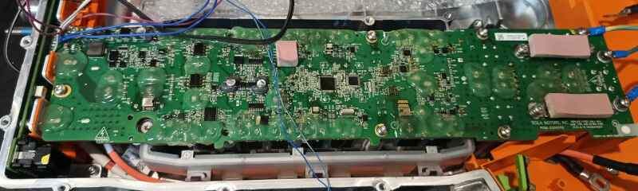
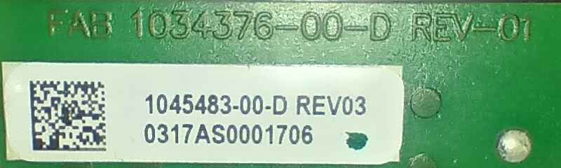
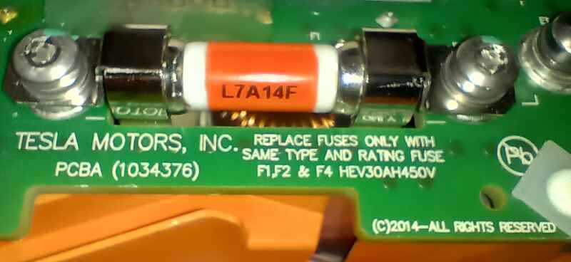
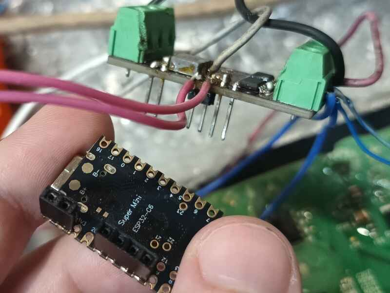

# Tesla GEN3 Single Phase Module Controller

Doxygen documentation available at: https://furdog.github.io/tesla_gen3_bcb/

## WIP
This project is actively work in progress and not ready for any usage yet.

Please check https://github.com/damienmaguire/Tesla-Charger .
This project is primarily based on Damien's codebase and knowledge.

You can also check https://github.com/jsphuebner/stm32-teslacharger
as alternative (similar software)

## Overview

(top view of single phase module board within Tesla BCB)

The `tg3spmc` library provides a **hardware-agnostic** logic layer for controlling a **Tesla GEN3 Single Phase Module** (tg3spmc), which is an internal component of the Tesla GEN3 Battery Controller Board (BCB).

This library implements the module's state machine, handles the encoding and decoding of **CAN 2.0 frames**, and manages the module's control signals (power on, charge enable).

**Key Features:**
  * **Hardware agnostic:** Absolute ZERO hardware-dependend code (except the examples)
  * **MISRA-C compliant:** Integration providen by cppcheck (100% compliance achieved for core library)
  * **Single header:** Makes integration with other projects super simple and seamless
  * **Pure C:** Pure C, specifically ANSI(C89) standard
  * **Automated tests:** Automatically tests main features (not TDD though, but aimed to be in the future)
  * **Documentation:** It is not really well made yet, but it's on the priority!
  * **Designed by rule of 10:** No recursion, dynamic memory allocations, callbacks, etc
  * **Deterministic:** Designed with constant time execution in mind
  * **GitHub actions:** Automated checks and doxygen generation

**Pitfalls:**
  * **Reverse engineering:** This is not an official firmware :(
  * **WIP:** Actively work in progress (not for production) 
  * **Not certified:** Use it at own risk

## Details

Board (PCB) Design code: FAB 1034376-00-D REV-01

Specific part code (QR): p1045483-00-d:REV03:S0317AS0001706

Tesla GEN3 Single Phase Module Board uses these control chips:
- MCU:  TMS320 f28035pag0   (The big one in center of the board)
- CPLD: ALTERA 5m160ze64a5n (Smaller piece, just near the MCU)

It's likely that MCU used for general complex tasks and communication while
CPLD is used for time-critical peripheral control.

I'd like to document and discover signals for every pin,
but thats gonna take some time and wish (which i do not have at the moment).
There are really more stuff to discover that may to drop some shades
onto the architecture of the module, but unfortunately i am not the expert
in the field of electronics, so any external help is highly appreciated.

There are generally 3 or 2 similar boards in single BCB.
We've just extracted other board(s).

(There are two fuses at the AC input side at each board)

For implementing my own controller i have used CAN filter board. That is used
for filtering BMS messages. It's not documented here and i do not see any
neccessarity because it's simple board which consists of:
- 12v->5v DCDC converter
- two TJA-1030 (or TJA-1050) CAN2.0 transcievers (dual CAN)
- Mount for ESP32-C6 board which has two native CAN2.0(TWAI) controllers
- ESP32-C6 board

I don't recomend to use specifically `Super Mini` board, because it has
serious PCB flaws.

For testing purposes i only use single built-in CAN2.0(TWAI) controller.

(CAN2.0 filter)

## Licensing
This repository contains code that is the original creation of furdog and licensed under MIT License.
See the LICENSE file for details.
This applies to the current version of the software.
As the sole author, the project owner (furdog) reserves the right to change
the license for future versions.

While the project is informed by general engineering knowledge and publicly available ideas,
no copyrighted material or explicit source code from other authors has been incorporated.
The content is asserted as original.

## Contributions
To maintain the flexibility to change the project's license in the future,
contributions are **NOT** being **ACCEPTED** at this time.
Though any suggestions, tips and insights are welcome.

## Project Discussions
To keep things organized and easy to follow, I’d really appreciate it if all questions, ideas, and issue reports stayed right here on this GitHub repository.

Having everything in one place makes it much easier for everyone to find information, track progress, and avoid confusion from scattered discussions elsewhere.

So if you’d like to chat about the code, suggest improvements, or report a bug - please open an Issue right here on GitHub.
Thanks for helping keep things tidy and transparent!

## AI content
This repository's core, is written and verified manually by the author (furdog).
However, certain non-critical elements, such as:
- comments
- documentation
- build scripts
- github actions

may contain content generated by Generative AI Systems.
